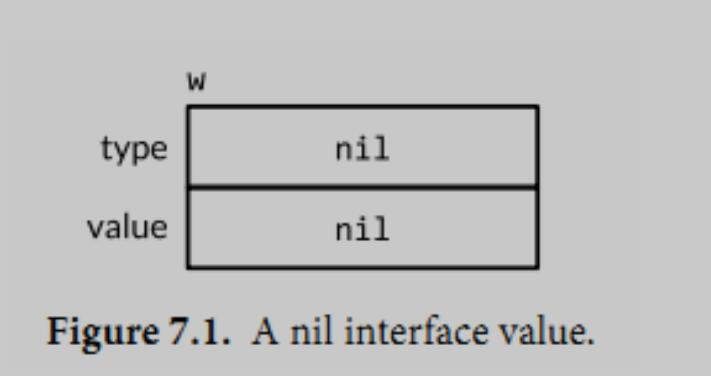
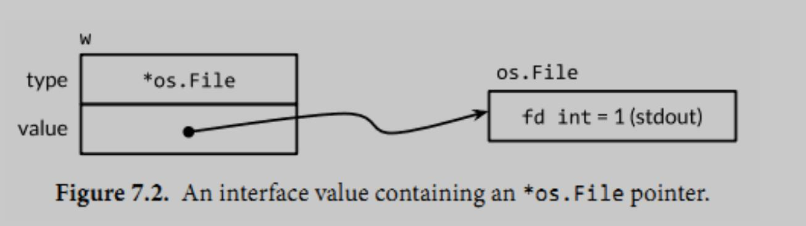
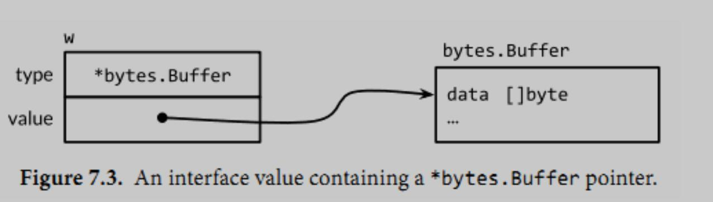

# 第七章 接口

* 对其他类型行为的抽象和概括
* 满足隐式实现

## 7.1 接口的约定
接口类型是抽象类型
它不会暴露它所代表的对象的内部值的结构和这个对象支持的基础操作的集合
它只会展示出他们自己的方法
示例`code/bytecounter`

## 7.2 接口类型
接口类型描述了一系列方法的集合，实现了这些方法的具体类型是这个接口的实例。
实例的方法顺序和接口的方法定义顺序没有影响
接口定义支持内嵌
```
type ReadWriter interface {
    Read(p []byte) (n int, err error)
    Writer
}
```

## 7.3 实现接口的条件
一个类型如果拥有一个接口需要的所有方法，那么这个类型就实现了这个接口。

对于具体类型T，它的一些接收者是类型T本身，也有T的指针，
一个T类型的参数调用一个T的方法是合法的，只要这个参数是一个变量，编译器会隐式的获取它的地址，
这仅仅是一个语法糖：T类型的值不拥有所有*T指针的方法，那么它可能只实现了更少的接口

```
type IntSet struct { /* ... */ }
func (*IntSet) String() string

// 无法通过编译，但是如果String()方法的接收者是一个值，而不是指针就没有任何问题
var _ = IntSet{}.String() // compile error: String requires *IntSet receiver

// 但是可以在一个IntSet值上调用
var s IntSet
var _ = s.String() 

// 由于只有指针类型的IntSet有String()方法，所以也只有指针类型的IntSet实现了fmt.Stringer接口
var _ fmt.Stringer = &s // OK
// 无法通过编译;
var _ fmt.Stringer = s // compile error: IntSet lacks String method
如果String()方法的接收者是值类型，那么无论该类型的值或这指针都实现了该接口
```

接口类型封装和隐藏具体类型和它的值，即使具体类型有其他的方法，也只有接口类型暴露出来的方法会被调用
```
var w io.Writer
w = os.Stdout
w.Write([]byte("hello")) // OK: io.Writer has Write method
w.Close() // compile error: io.Writer lacks Close method；即使os.Stdout有Close()方法也不能调用
```

空接口类型(没有任何方法)`interface{}`可以接收任意值的赋值

## 7.4 flag.Value接口
示例`code/sleep`、`code/tempconv`

## 7.5 接口值

接口值有两部分组成：具体类型和类型值，他们被称为动态类型和动态值(可以持有任意大的动态值)；
类型是编译期的概念，因此一个类型不是一个值
变量总是被一个定义明确的值初始化，接口类型也不例外
可以通过`w==nil`或者`w!=nil`来判断接口值是否为空，调用一个空接口的任意方法都会产生`panic`
两个接口值相等，仅当它们都是nil值或者它们的动态类型相同并且动态值也根据这个类型的的`==`操作相等

针对下面4个语句，w得到了3个不同的值(开始和最后是相同的)
```
var w io.Writer
w = os.Stdout
w = new(bytes.Buffer)
w = nil
```

`var w io.Writer`它的类型和值部分都是nil


`w = os.Stdout`将一个`*os.File`类型的值赋给变量w；这个赋值过程调用了一个具体类型到接口类型的隐式转换；
这个接口的动态类型被设为`*os.Stdout`指针的类型描述符，动态值持有`os.Stdout`的拷贝


`w = new(bytes.Buffer)`，现在动态类型是`*bytes.Buffer`，动态值是一个指向新分配的缓冲区的指针


`w = nil`，重置将它所有的部分设置为nil值

### 7.5.1 警告：一个包含nil指针的接口不是nil接口

一个不包含任何值的nil接口值和一个刚好包含nil指针的接口值是不同的。

```
const debug = true
func main() {
    var buf *bytes.Buffer
    if debug {
        buf = new(bytes.Buffer) // enable collection of output
    }
    f(buf) // NOTE: subtly incorrect!
}

// If out is non-nil, output will be written to it.
func f(out io.Writer) {
    // ...do something...
    if out != nil {
        out.Write([]byte("done!\n"))
    }
}
```
当`debug=false`时候，函数f会发生panic。
这是因为，当调用f时候，main函数传递了一个`*bytes.Buffer`的空指针，所以out的动态值是nil，然而它的动态类型是`*bytes.Buffer`,
意思是out变量是一个包含空指针的非空接口，所以`out!=nil`的结果依然是true。
解决办法是将main函数中变量buf的类型改为`io.Writer`,这样就可以避免一开始就将一个不完全的值赋值给这个接口
```
var buf io.Writer
if debug {
    buf = new(bytes.Buffer)
}
f(buf)      // ok
```

## 7.6 sort.Interface接口

Go的排序算法的接口
```
package sort

type Interface interface {
    Len() int
    Less(i, j int) bool // i, j are indices of sequence elements
    Swap(i, j int)
}
```
为了对序列进行排序，需要定义以上3个方法，然后对这一类型的示例应用`sort.Sort`函数
示例`code/sorting`
练习题:7.8, 7.9, 7.10

## 7.7 http.Handler接口
```
net/http

package http

type Handler interface {
    ServeHTTP(w ResponseWriter, r *Request)
}
// address: ":8000", handler: 一个所有请求都可以分派的Handler接口实例
func ListenAndServe(address string, h Handler) error
```
示例:`code/http1`, `code/http2`,`code/http3`， `code/http4`
练习:`exercises/7.11`, `exercises/7.12`

## 7.8 error接口

error类型，实际上就是interface类型
```
type error interface {
    Error() string
}
```
`errors`包中的`New()`方法返回一个新的`error`，由于源码中是`*errorString`类型满足error接口而非`errorString`类型，
所以每次`New()`或者`fmt.Errorf`调用都会分配一个独特的和其他错误不相同的实例

## 7.9 示例：表达式求值
略

## 7.10 类型断言

类型断言是一个使用在接口值上的操作，`x.(T)`，x是一个接口类型，T标示一个类型(具体类型或者一个接口类型)。
类型断言会返回x的值和一个布尔值，可根据该布尔值判断x是否为T类型；
如果类型断言的对象是一个nil值，这个类型断言都会失败。

## 7.11 基于类型断言区别错误类型

配合源码`os/errors.go`阅读

## 7.12 通过类型断言询问行为
使用一个类型断言来知道一个普遍接口类型的值是否满足一个更加具体的接口类型；并且如果满足，它会使用这个更具体接口的行为
```
func writeString(w io.Writer, s string) (n int, err error) {
    // 这里定义了一个接口，判断w是不是满足这个接口的示例，如果是则可以调用该接口的行为WriteString()
    type stringWriter interface {
        WriteString(string) (n int, err error)
    }
    if sw, ok := w.(stringWriter); ok {
        return sw.WriteString(s) // avoid a copy
    }
    return w.Write([]byte(s)) // allocate temporary copy
}
```

## 7.13 类型开关
```
// 此新变量x的定义不会和外面块中的x变量冲突。每一个case也会隐式的创建一个单独的语言块
switch x := x.(type) {
    case nil: // ...
    case int, uint: // ...
    case bool: // ...
    case string: // ...
    default: // ...
}
```

7.14. 示例: 基于标记的XML解码
示例:`code/xmlselect`